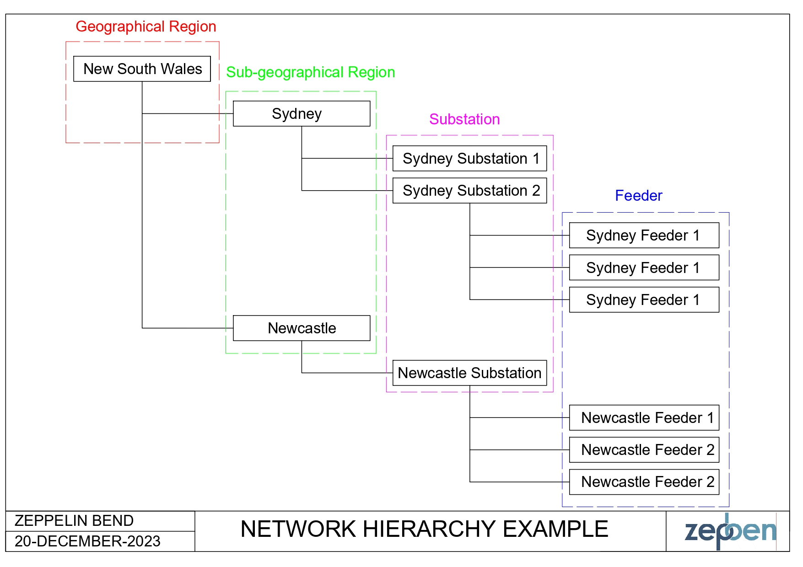
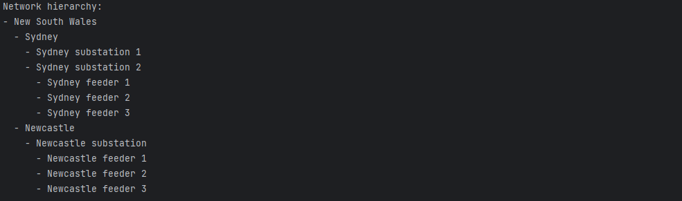

A network hierarchy describes the high-level hierarchy of the network. This tutorial will demonstrate how to build a network hierarchy on your own.
For demonstration purpose only, we will build a simple network hierarchy shown in the following diagram where we have Geographical Region (New South Wales), Sub-geographical Regions (Sydney and Newcastle), Corresponding Substations (Sydney Substations 1 and 2, and Newcastle Substation), Corresponding Feeders (Sydney Feeders 1, 2, and 3, and Newcastle Feeders 1, 2 and 3).



## Getting Started

Ensure that you have installed and imported the required dependencies.

```python
from zepben.evolve import NetworkHierarchy, GeographicalRegion, SubGeographicalRegion, Feeder, Substation, Loop, Circuit
```

## Define Network Hierarchy Components

First, you will need to create instances of Feeders, Substations, Circuits, Loops, and Geographical and Sub-Geographical Regions to represent the components of the network hierarchy.

```python
fdr1 = Feeder(name="Sydney feeder 1")
fdr2 = Feeder(name="Sydney feeder 2")
fdr3 = Feeder(name="Sydney feeder 3")
fdr4 = Feeder(name="Newcastle feeder 1")
fdr5 = Feeder(name="Newcastle feeder 2")
fdr6 = Feeder(name="Newcastle feeder 3")

sub1 = Substation(name="Sydney substation 1")
sub2 = Substation(name="Sydney substation 2", normal_energized_feeders=[fdr1, fdr2, fdr3])
sub3 = Substation(name="Newcastle substation", normal_energized_feeders=[fdr4, fdr5, fdr6])

circuit_sydney = Circuit(end_substations=[sub1, sub2])
loop_sydney = Loop(circuits=[circuit_sydney], substations=[sub1], energizing_substations=[sub2])
sgr_sydney = SubGeographicalRegion(name="Sydney", substations=[sub1, sub2])
sgr_newcastle = SubGeographicalRegion(name="Newcastle", substations=[sub3])

gr_nsw = GeographicalRegion(name="New South Wales", sub_geographical_regions=[sgr_sydney, sgr_newcastle])
```

## Build Network Hierarchy

In this step, we build the network hierarchy by organizing the previously defined components into the hierarchy structure.
The `NetworkHierarchy` class is used to represent the overall structure, as follows.

```python
network_hierarchy = NetworkHierarchy(
    geographical_regions={gr_nsw.mrid: gr_nsw},
    sub_geographical_regions={sgr.mrid: sgr for sgr in (sgr_sydney, sgr_newcastle)},
    substations={sub.mrid for sub in (sub1, sub2, sub3)},
    feeders={fdr.mrid: fdr for fdr in (fdr1, fdr2, fdr3, fdr4, fdr5, fdr6)},
    circuits={circuit_sydney.mrid: circuit_sydney},
    loops={loop_sydney.mrid: loop_sydney}
)
```

## Print the Network Hierarchy

You can print the constructed network hierarchy to visualize its structure.
The script iterates through geographical regions, sub-geographical regions, substations, and feeders to display the hierarchy.

```python
print("Network hierarchy:")
for gr in network_hierarchy.geographical_regions.values():
    print(f"- {gr.name}")
    for sgr in gr.sub_geographical_regions:
        print(f"  - {sgr.name}")
        for sub in sgr.substations:
            print(f"    - {sub.name}")
            for fdr in sub.feeders:
                print(f"      - {fdr.name}")
```

Output:

