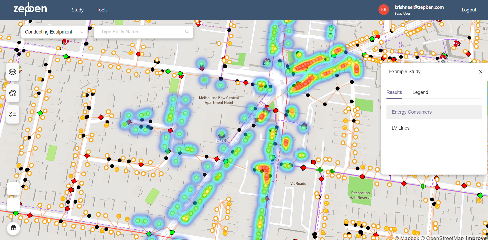
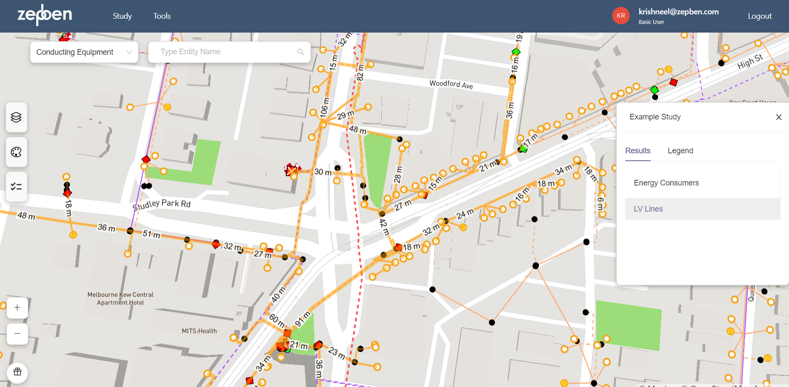

import Tabs from '@theme/Tabs';
import TabItem from '@theme/TabItem';

A feature of the Evolve App Server (EAS) allows the users to create and visualize studies. A study is a geographical visualisation of data that is drawn on top of the network.
This data can typically be the result of a load flow simulation, external input file containing data related to the network or even the information about the network (such as length of lines, counts of objects, etc.).
Each study can contain multiple results: different visualisations that the user may switch between.
For example, the first result may display per-unit voltage data from a load flow result, while the second study can provide a heatmap of the energy consumer density of a specified feeder.
In this tutorial, we will create two studies: one makes a heatmap of energy consumers and the other highlights LV lines and displays their length.

**Note:** Both Evolve App Server and Energy Workbench are required for creating and uploading studies.
Hence, you should ensure that both the servers are running for this example. Guidelines for connecting to an Evolve App Server will be provided in this tutorial.

## Getting Started

Ensure that you have installed the required dependencies and imported the libraries. For this example, we will use `json`, `geojson`, `zepben.eas` and `zepben.evolve` libraries.
Information about connecting to the Energy Workbench Server can be found in the [Connecting to the EWB Server](connecting-to-ewb.mdx) tutorial.


```python
import json
from geojson import Feature, LineString, FeatureCollection, Point
from zepben.eas import Study, Result, GeoJsonOverlay, EasClient
from zepben.evolve import connect_with_token, NetworkConsumerClient, AcLineSegment, EnergyConsumer
from zepben.protobuf.nc.nc_requests_pb2 import INCLUDE_ENERGIZED_LV_FEEDERS
```

## Connecting to the EWB gRPC Service

Here, we connect to the EWB Server, using the `connect_with_token` function.

```python
with open("../config.json") as f:
    c = json.loads(f.read())

channel = connect_with_token(host=c["host"], access_token=c["access_token"], rpc_port=c["rpc_port"])

```
You will need to replace the values in the config.json file with the appropriate configuration for your environment. The config file should look like this:

```json
{
  "host": "EWB Hostname",
  "access_token": "your_access_token",
  "rpc_port": 1234
}
```
More information about connecting to the EWB Server using different methods can be found in the [Connecting to the EWB Server](connecting-to-ewb.mdx) tutorial.

You will need to specify the mRID of the feeder that you want to fetch, ensuring that the feeder with the specified mRID exists.
Then, create a `NetworkConsumerClient` and retrieve the network service.
The `get_equipment_container` method is used to fetch information about the specified feeder (feeder_mrid).
The `INCLUDE_ENERGIZED_LV_FEEDERS` flag indicates that the client should include information about energized LV (Low Voltage) feeders in the response.


```python
feeder_mrid = "LV007"
grpc_client = NetworkConsumerClient(grpc_channel)
await grpc_client.get_equipment_container(feeder_mrid, include_energized_containers=INCLUDE_ENERGIZED_LV_FEEDERS)
network = grpc_client.service
```

## Connecting to the Evolve App Server

We use the `EasClient` to connect to the Evolve App Server. `EasClient` is a class used to represent a client to the Evolve App Server, with methods that represent requests to its API.
For the examples in this tutorial, we will use the following code to connect to the EAS.

```python
eas_client = EasClient(host=c["host"], port=c["rpc_port"], protocol="https", access_token=c["access_token"])
```

- **host** - The domain of the Evolve App Server, e.g. "evolve.local"
- **port** - The port on which to make requests to the Evolve App Server, e.g. 7624
- **access_token** - The personal access token you generated from the UI.
- **protocol** - The protocol to use for connecting to EAS. Either http or https.

Note: Ensure that the values for host, port, and token are correctly provided in the config.json file.

## Create Results for Energy Consumers Density Example

Here, we will create a heatmap of the EnergyConsumer density for a specified feeder.
First, we will iterate through each `EnergyConsumer` object in the network and check if the `EnergyConsumer` has locations associated with it.
If `EnergyConsumer`s have locations, we will create GeoJSON features for those `EnergyConsumer`s with their mRID and `Point` geometry based on the extracted coordinates.
The created GeoJSON feature will be added to the list `ec_geojson`.

```python
ec_geojson = []
    for ec in network.objects(EnergyConsumer):
        if ec.location is not None:
            coord = list(ec.location.points)[0]
            ec_feature = Feature(
                id=ec.mrid,
                geometry=Point((coord.x_position, coord.y_position))
            )
            ec_geojson.append(ec_feature)
```

Now, we will create a `Result` object named "Energy Consumers" with a GeoJSON overlay. The GeoJSON overlay includes the collected GeoJSON features in a `FeatureCollection` and a style named "ec-heatmap".

```python
ec_result = Result(
        name="Energy Consumers",
        geo_json_overlay=GeoJsonOverlay(
            data=FeatureCollection(ec_geojson),
            styles=["ec-heatmap"]  # Select which Mapbox layers to show for this result
        )
    )
```

The style "ec_heatmap" is the Mapbox layer to be shown for this result, indicating how the Energy Consumer Density should be styled in the visualization.
The following style is used for "ec_heatmap". Note that you will need to copy and paste the below code into a json file and then specify the path of this json file later in the code when uploading the study.

```json
{
    "id": "ec-heatmap",
    "type": "heatmap",
    "paint": {
      "heatmap-opacity": 0.5
    },
    "metadata": {
      "zb:legend": {
        "label": "Energy Consumer Density"
      }
    }
  }
```

## Create Results for LV Lines Example

This example will highlight the low voltage (LV) lines of a specified feeder and will display the length of each line.
First, we will iterate through each `AcLineSegment` object in the network and find the LV lines that have locations. For this example, we identify the LV lines based on the base voltage of the line (i.e., lines with voltages less than 1000 volts).
We then create GeoJSON features for those LV lines with their mRID.
The geometry is a `LineString` constructed from the line's location points, and additional line length property is included to display the length of each LV line.
The created GeoJSON feature is added to the list `lv_lines_geojson`.

```python
lv_lines_geojson = []
    for line in network.objects(AcLineSegment):
        if line.base_voltage_value <= 1000 and line.location is not None:
            line_feature = Feature(
                id=line.mrid,
                geometry=LineString([(p.x_position, p.y_position) for p in line.location.points]),
                properties={
                    "length": line.length  # Numeric and textual data may be added here. It will be displayed and formatted according to the style(s) used.
                }
            )
            lv_lines_geojson.append(line_feature)
```

Now, we will create a `Result` object named "LV Lines" with a GeoJSON overlay. The GeoJSON overlay includes the collected GeoJSON features in a FeatureCollection.

```python
lv_lines_result = Result(
        name="LV Lines",
        geo_json_overlay=GeoJsonOverlay(
            data=FeatureCollection(lv_lines_geojson),
            styles=["lv-lines", "lv-lengths"]  # Select which Mapbox layers to show for this result
        )
    )
```

The styles specified by "lv-lines" and "lv-lengths" are Mapbox layers to be shown for this result, indicating how the LV lines should be styled in the visualization.
The following styles are used for "lv_lines" and "lv_lengths". Note that you will need to copy and paste the below code into a json file and then specify the path of this json file later in the code when uploading the study.

```json
{
    "id": "lv-lines",
    "type": "line",
    "paint": {
      "line-color": "orange",
      "line-width": ["log2", ["max", ["get", "length"], 1]],
      "line-opacity": 0.5
    },
    "metadata": {
      "zb:legend": {
        "label": "LV Line",
        "states": [
          {
            "label": "1 m",
            "properties": {
              "length": 1
            }
          },
          {
            "label": "10 m",
            "properties": {
              "length": 10
            }
          },
          {
            "label": "100 m",
            "properties": {
              "length": 100
            }
          },
          {
            "label": "1000 m",
            "properties": {
              "length": 1000
            }
          }
        ]
      }
    }
  },
  {
    "id": "lv-lengths",
    "type": "symbol",
    "layout": {
      "symbol-placement": "line",
      "text-field": ["concat", ["round", ["get", "length"]], " m"],
      "text-font": ["Arial Unicode MS Regular"],
      "text-size": 15
    },
    "paint": {
      "text-color": "black",
      "text-halo-blur": 5,
      "text-halo-width": 5,
      "text-halo-color": "white"
    }
  }
```

## Create and Upload Studies

Once you have created the Results for the studies, the next step is to create and upload the study on EAS.
A data class (`Study`) represents an Evolve App Server study. The user need to provide information such as name, descriptions, tags, results, and styles to successfully create a study.

```python
study = Study(
        name="Example Study",
        description="Example study with two results.",
        tags=["example"],
        results=[ec_result, lv_lines_result],
        styles=json.load(open("style.json", "r"))
    )
```

> INPUT:

- **name** - name of the study being created.
- **description** - short description of the study.
- **tags** - unique identification of the study to make it easier to search for studies from a large list.
- **results** - data classes representing an Evolve App Server study results.
- **styles** - This is the "layers" property of a Mapbox GL JS style. Layers specify how features are rendered. For more information about layers, read https://docs.mapbox.com/mapbox-gl-js/style-spec/layers/.

Note: Each layer may have an entry in the legend via the metadata["zb:legend"] field.

The final step after creating the study is to upload it on the EAS and close the EAS client, as follows.

```python
await eas_client.async_upload_study(study)
await eas_client.aclose()
```

## Output (Studies)

### Energy Consumer Density Study on EAS



### LV Lines Study on EAS


