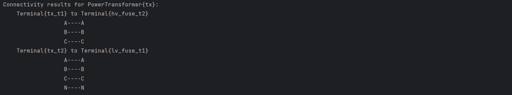
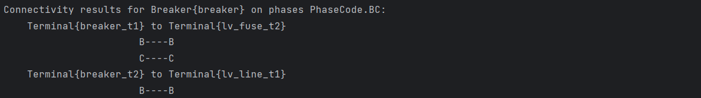
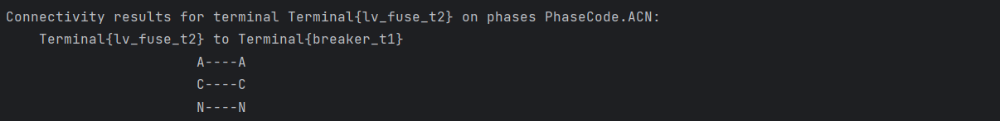

import Tabs from '@theme/Tabs';
import TabItem from '@theme/TabItem';

This example demonstrates how to examine the connectivity of a power system network.
In this example, we will build a simple network shown below and test the connectivity between different equipment.


## Getting Started

Ensure that you have installed and imported the required dependencies.

```bash
from zepben.evolve import EnergySource, AcLineSegment, Fuse, PowerTransformer, Breaker, EnergyConsumer, NetworkService, Terminal, connected_equipment, \
    ConductingEquipment, PhaseCode, connected_terminals, ConnectivityResult
```

## Part A: Create a Network (Simple Example)

### Step 1: Create an Energy Source

An Energy Source is a generic equivalent for an energy supplier on a transmission or distribution voltage level.
Energy sources are the foundation of power networks as they provide the electricity needed for various applications.
To create an energy source, you need to use the `EnergySource` class. To connect this Energy Source to any other equipment, you need to create a `Terminal` (an AC electrical connection point to a piece of conducting equipment) for the energy source. Use the Terminal class to create a terminal for the energy source.

```bash
es_t = Terminal(mrid="es-t")
es = EnergySource(mrid="es", terminals=[es_t])
```

### Step 2: Create the HV Line

The HV Line in this example will be created using the `AcLineSegment` class. AC Line Segment can be a wire or a combination of wires with consistent electrical characteristics, building a single electrical system, used to carry alternating current between points in the power system.
An AC Line Segment has two ends. Hence, you will need to create a `Terminal` for each end to be able to connect the Line to any other equipment.

```bash
hv_line_t1, hv_line_t2 = Terminal(mrid="hv_line_t1"), Terminal(mrid="hv_line_t2")
hv_line = AcLineSegment(mrid="hv_line", terminals=[hv_line_t1, hv_line_t2])
```

### Step 3: Create the HV Fuse

A fuse is an overcurrent protective device with a circuit opening fusible part that is heated and severed by the passage of overcurrent through it. A fuse is considered a switching device because it breaks current.
The `Fuse` class will be used to create a fuse in this example. Note that a fuse has two ends, so you will need to create a `Terminal` for each end to be able to connect to other equipment in the network.

```bash
hv_fuse_t1, hv_fuse_t2 = Terminal(mrid="hv_fuse_t1"), Terminal(mrid="hv_fuse_t2")
hv_fuse = Fuse(mrid="hv_fuse", terminals=[hv_fuse_t1, hv_fuse_t2])
```

### Step 4: Create a Power Transformer

A Power Transformer is an electrical device consisting of  two or more coupled windings, with or without a magnetic core, for introducing mutual coupling between electric circuits.
A Power Transformer typically has two terminals, but may have one (grounding), three or more terminals.
In this example, we are creating a two-winding transformer, so the transformer will consist of two ends that will connect to other devices in the network as shown in the simple example diagram.
The `PowerTransformer` class will be used to create the Power Transformer, and the `Terminal` class for creating the terminal for the Power Transformer, as follows.

```bash
tx_t1, tx_t2 = Terminal(mrid="tx_t1"), Terminal(mrid="tx_t2", phases=PhaseCode.ABCN)
tx = PowerTransformer(mrid="tx", terminals=[tx_t1, tx_t2])
```

### Step 5: Create the LV Fuse

Description: Same as Step 3..

```bash
lv_fuse_t1, lv_fuse_t2 = Terminal(mrid="lv_fuse_t1", phases=PhaseCode.ABCN), Terminal(mrid="lv_fuse_t2", phases=PhaseCode.ABCN)
lv_fuse = Fuse(mrid="lv_fuse", terminals=[lv_fuse_t1, lv_fuse_t2])
```

### Step 6: Create a Circuit Breaker

A Breaker is a mechanical switching device capable of making, carrying, and breaking currents under normal circuit conditions and also making, carrying for a specified time, and breaking currents under specified abnormal circuit conditions e.g. those of short circuit.
The `Breaker` class will be used to create the Circuit Breaker in this example. Since a breaker has two ends, we will create a terminal at both ends so that the breaker can be connected to other devices.

```bash
breaker_t1, breaker_t2 = Terminal(mrid="breaker_t1", phases=PhaseCode.ABCN), Terminal(mrid="breaker_t2", phases=PhaseCode.BN)
breaker = Breaker(mrid="breaker", terminals=[breaker_t1, breaker_t2])
```

### Step 7: Create the LV Line

Description: Same as Step 2.

```bash
lv_line_t1, lv_line_t2 = Terminal(mrid="lv_line_t1", phases=PhaseCode.BN), Terminal(mrid="lv_line_t2", phases=PhaseCode.BN)
lv_line = AcLineSegment(mrid="lv_line", terminals=[lv_line_t1, lv_line_t2])
```

### Step 8: Create an Energy Consumer

An Energy Consumer is a generic user of energy - a point of consumption on the power system phases. May also represent a pro-sumer with negative p/q values.
The `EnergyConsumer` class will be used to create an energy consumer in this example, and a terminal will be created for the energy consumer so that it can be connected to other devices in the network.

```bash
ec_t = Terminal(mrid="ec_t", phases=PhaseCode.BN)
ec = EnergyConsumer(mrid="ec", terminals=[ec_t])
```

### Step 9: Create a Network Service

Once you have created the devices, they need to be added to a Network Service.
A `NetworkService` is a mutable node breaker network model that implements a subset of IEC61968 and IEC61970 CIM classes.
It is essentially a collection of `IdentifiedObject`s, and they may be added and removed as desired.
The following code is used to add all the above created devices to the Network Service.

```bash
network = NetworkService()
for io in [es_t, es, hv_line_t1, hv_line_t2, hv_line, hv_fuse_t1, hv_fuse_t2, hv_fuse, tx_t1, tx_t2, tx, lv_fuse_t1, lv_fuse_t2, lv_fuse, breaker_t1,
           breaker_t2, breaker, lv_line_t1, lv_line_t2, lv_line, ec_t, ec]:
    network.add(io)
```

### Step 10: Connect Objects

The final step is to connect the objects (created in Steps 1 to 8) and add it to the network (created in Step 9).
The `connect_terminals` function will be used to connect the two terminals, as follows:

- Connect Energy Source to the HV Line
```bash
network.connect_terminals(es_t, hv_line_t1)
```
- Connect HV Line to the HV Fuse
```bash
network.connect_terminals(hv_line_t2, hv_fuse_t1)
```
- Connect HV Fuse to the Power Transformer
```bash
network.connect_terminals(hv_fuse_t2, tx_t1)
```
- Connect Power Transformer to the LV Fuse
```bash
network.connect_terminals(tx_t2, lv_fuse_t1)
```
- Connect LV Fuse to the Breaker
```bash
network.connect_terminals(lv_fuse_t2, breaker_t1)
```
- Connect Breaker to the LV Line
```bash
network.connect_terminals(breaker_t2, lv_line_t1)
```
- Connect LV Line to the Energy Consumer
```bash
network.connect_terminals(lv_line_t2, ec_t)
```

## Part B: Examine Connectivity of the Network

This section explores examples of connectivity analysis of power systems (particularly the simple example that was built using the above guide).
This example provides functions to print connectivity results between different equipment and terminals, including information about nominal phase paths.

### Functions
In this example, we will use two main functions to display the connectivity results.

1. First, we will use the `fancy_print_connectivity_result` function to display a formatted representation of the connectivity result.
This function takes `ConnectivityResult` as an input and displays the source and destination terminals. It then iterates over the nominal phase paths and prints the phase information about the terminals.
Note: ConnectivityResult is a class defined in `zepben.evolve` module. It is used to store the connectivity between two terminals, including the mapping between the nominal phases.
This class is intended to be used in an immutable way. You should avoid modifying it after it has been created.

```bash
def fancy_print_connectivity_result(connectivity_result: ConnectivityResult):
    print(f"\t{connectivity_result.from_terminal} to {connectivity_result.to_terminal}")

    terminal_str_len = len(str(connectivity_result.from_terminal))
    for core_path in connectivity_result.nominal_phase_paths:
        print(f"\t{core_path.from_phase.name:>{terminal_str_len}}----{core_path.to_phase.name}")
```

2. We will also use the `fancy_print_connected_equipment` function to display the connectivity results for the specified equipment, considering the specified phases.
This function takes `ConductingEquipment` and an optional `phases` arguments as input.
Note: ConductingEquipment is an abstract class defined in `zepben.evolve` module. ConductingEquipment are parts of the AC power system that are designed to carry current or that are conductively connected through terminals.

```bash
def fancy_print_connected_equipment(equipment: ConductingEquipment, phases=None):
    if phases:
        print(f"Connectivity results for {equipment} on phases {phases}:")
    else:
        print(f"Connectivity results for {equipment}:")
    for connectivity_result in connected_equipment(equipment, phases):
        fancy_print_connectivity_result(connectivity_result)
    print()
```

### Example Usages

This section demonstrates how to use the above functions with different equipment and phase configurations.

Example 1: The code snippet `fancy_print_connected_equipment(tx)` prints the connectivity results for the Power Transformer (tx). Since no phase information is provided, the `default=None` is used.

Output:



Example 2: The code snippet `fancy_print_connected_equipment(tx, phases=PhaseCode.N)` prints the connectivity results for the Power Transformer (tx), considering only the `N` phase.

Output:


Example 3: The code snippet `fancy_print_connected_equipment(breaker, phases=PhaseCode.BC)` prints the connectivity results for the Breaker (breaker), considering only the `B` and `C` phases.

Output:



Example 4: The following code prints the connectivity results for the terminal `lv_fuse_t2` with phases `ACN` using the `connected_terminals` function. Note that `connected_terminals` is essentially `connected_equipment` where only one terminal is considered.

```bash
print(f"Connectivity results for terminal {lv_fuse_t2} on phases {PhaseCode.ACN}:")
for connectivity_result in connected_terminals(lv_fuse_t2, PhaseCode.ACN):
    fancy_print_connectivity_result(connectivity_result)
```

Output:

