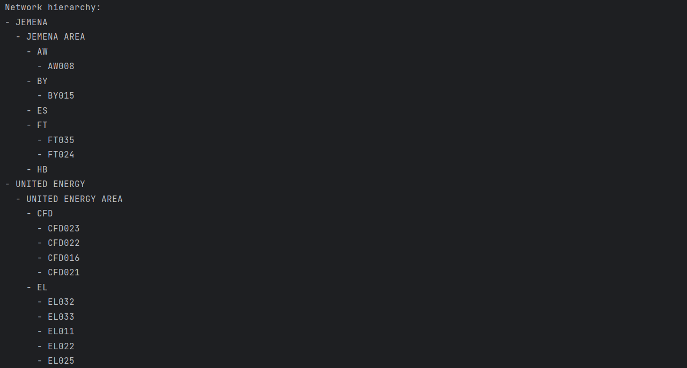

import Tabs from '@theme/Tabs';
import TabItem from '@theme/TabItem';

This tutorial demonstrates how to use the `NetworkConsumerClient` to connect to a gRPC service and fetch information about a network hierarchy from the EWB server.
The code is organized to demonstrate how to establish a connection, retrieve the network hierarchy, and print the information in a structured manner.

## Getting Started

Ensure that you have imported necessary modules from the Zepben library.

```bash
from zepben.evolve import NetworkConsumerClient, connect_with_token
import json
```

## Establish Connection

Before connecting, ensure that you have a `config.json` file that includes the connection parameters, such as `host`, `access_token`, and `rpc_port`.
Here is an example of the `config.json` file format.

```json
{
    "host": "your-ewb-hostname",
    "access_token": "your-access-token",
    "rpc_port": 1234
}
```

Now, establish the connection by using the `connect_with_token` function, which securely connects to the EWB server using an access token.

```bash
with open("config.json") as f:
    c = json.loads(f.read())

channel = connect_with_token(host=c["host"], access_token=c["access_token"], rpc_port=c["rpc_port"])

```

## Create a Consumer Client

After establishing the connection, create a `NetworkConsumerClient` using the provided channel.

```bash
client = NetworkConsumerClient(channel=channel)
```

## Fetch and Display Network Hierarchy

You can fetch the network hierarchy by calling the `get_network_hierarchy` method on the `NetworkConsumerClient` instance.
Once you have fetched the network hierarchy, you can iterate through the hierarchical structure and print information about each level (that is the geographical regions, sub-geographical regions, substations, and feeders).
In this example, indentation is used to help represent the hierarchical relationships clearly.

```bash
network_hierarchy = await client.get_network_hierarchy()
print("Network hierarchy:")
for gr in network_hierarchy.result.geographical_regions.values():
print(f"- {gr.name}")
for sgr in gr.sub_geographical_regions:
    print(f"  - {sgr.name}")
    for sub in sgr.substations:
        print(f"    - {sub.name}")
        for fdr in sub.feeders:
            print(f"      - {fdr.name}")
```

Sample Output:




