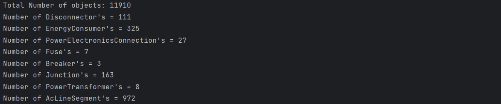
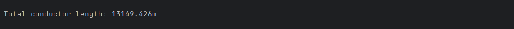
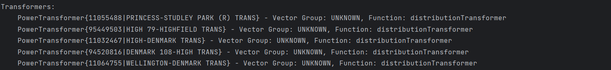
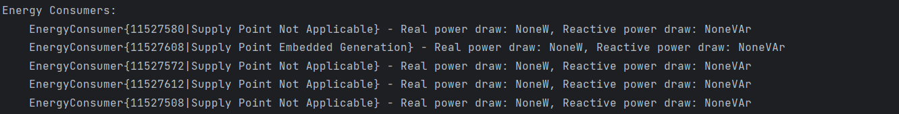
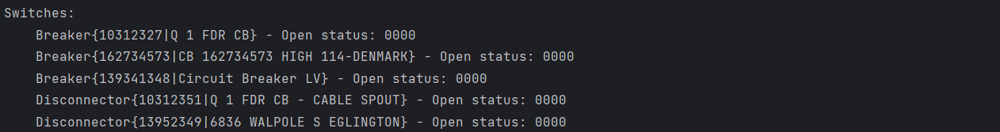

In this tutorial, we will explore a Python script that utilizes the APIs to fetch information about an electrical network from the Energy Workbench.
The script connects to the EWB Server, retrieves data about a specific feeder, and prints details about the network equipment such as conductors, transformers, energy consumers, and switches.

## Getting Started

Ensure that you have imported necessary modules from the Zepben library.

```python
from zepben.evolve import Conductor, PowerTransformer, SyncNetworkConsumerClient, ConductingEquipment, EnergyConsumer, Switch, \
    connect_insecure
from zepben.protobuf.nc.nc_requests_pb2 import INCLUDE_ENERGIZED_LV_FEEDERS, INCLUDE_ENERGIZED_FEEDERS, INCLUDE_ENERGIZING_SUBSTATIONS, \
    INCLUDE_ENERGIZING_FEEDERS
```
Also ensure that you have connected to the EWB Server. In this example, the `connect_insecure` function is used to connect to the EWB Server but you will need the connection mechanism appropriate for your server.

```python
channel = connect_insecure(host="EWB Hostname", rpc_port=1234)
```
You will need to replace the host and port with the appropriate values for your environment.
More information about connecting to the EWB Server using different methods can be found in the [Connecting to the EWB Server](https://zepben.github.io/evolve/docs/python-sdk/next/sdk-consumer#connecting-to-a-server) guide.

**Note:** All other examples relating to using the EWB server can use any of the connection methods depending on the configuration of the EWB server.


## Fetch Feeder Information

You will need to specify the mRID of the feeder that you want to fetch, ensuring that the feeder with the specified mRID exists.
Then, create a `SyncNetworkConsumerClient` and retrieve the network service.
The `get_equipment_container` method is used to fetch information about the specified feeder (`feeder_mrid`).
The `INCLUDE_ENERGIZED_LV_FEEDERS` flag indicates that the client should include information about energized LV (Low Voltage) feeders in the response.

**Note:** You should create a new client for each Feeder you retrieve. There is also a `NetworkConsumerClient` that is asyncio compatible, with the same API.

```python
feeder_mrid = "LV007"
client = SyncNetworkConsumerClient(channel=channel)
network = client.service
client.get_equipment_container(feeder_mrid, include_energized_containers=INCLUDE_ENERGIZED_LV_FEEDERS).throw_on_error()
```

There are other methods available to fetch a container. Some of them are explained below:

- Fetching substation equipment and including equipment from HV/MV feeders powered by it:

```python
client.get_equipment_container("substation ID", include_energized_containers=INCLUDE_ENERGIZED_FEEDERS)
```

- Same as above, but also fetching equipment from LV feeders powered by the HV/MV feeders

```python
client.get_equipment_container("substation ID", include_energized_containers=INCLUDE_ENERGIZED_LV_FEEDERS)
```

- Fetching feeder equipment without fetching any additional equipment from powering/powered containers

```python
client.get_equipment_container("feeder ID")
```

- Fetching HV/MV feeder equipment, the equipment from the substation powering it, and the equipment from the LV feeders it powers

```python
client.get_equipment_container("feeder ID",
                               include_energizing_containers=INCLUDE_ENERGIZING_SUBSTATIONS,
                               include_energized_containers=INCLUDE_ENERGIZED_LV_FEEDERS)
```

- Fetching LV feeder equipment and including equipment from HV/MV feeders powering it

```python
client.get_equipment_container("LV feeder ID", include_energizing_containers=INCLUDE_ENERGIZING_FEEDERS)
```

- Same as above, but also fetching equipment from the substations powering the HV/MV feeders

```python
client.get_equipment_container("LV feeder ID", include_energizing_containers=INCLUDE_ENERGIZING_SUBSTATIONS)
```

## Analysing Network Objects

This example prints the total number of objects in the network and provides a breakdown of the number of objects for each type of `ConductingEquipment`.
It utilizes the `len_of` method to get the total count and iterates through the unique types present in the network.

```python
print(f"Total Number of objects: {client.service.len_of()}")
types = set(type(x) for x in network.objects(ConductingEquipment))
for t in types:
    print(f"Number of {t.__name__}'s = {len(list(network.objects(t)))}")
```

Output:

A sample output for a feeder is shown below (for demonstration purpose only). Note that the results will vary for different feeders depending on the network.



## Calculating Conductor Length

You can also calculate the total length of conductors in the feeder.
In this example, the provided python code iterates through all objects of type `Conductor`, checks if each conductor has a valid length attribute, and accumulates the lengths.

```python
total_length = 0
for conductor in network.objects(Conductor):
    try:
        if conductor.length is not None:
            total_length += conductor.length
    except AttributeError:
        print(f"Warning: Conductor {conductor} does not have a 'length' attribute.")
```

Output:



## Retrieving Objects from the Feeder

This example demonstrates how the script can be used to retrieve and print the feeder object from the network. For the sake of demonstration, we will retrieve and display only a few objects from the network, including power transformers, energy consumers, and switches.

### Example 1: Retrieving Power Transformers

In this example, we retrieve and print the transformers from the network.
First, the provided code retrieves a feeder object from the network using the `feeder_mrid` as a parameter.
Then, the code iterates over the equipment in the feeder. For each equipment item, it checks if it is an instance of the `PowerTransformer` class. If it is, it prints information about the transformer, including its representation (`eq`), vector group, and function.

```python
feeder = network.get(feeder_mrid)
print("Transformers:")
for eq in feeder.equipment:
    if isinstance(eq, PowerTransformer):
        print(f"    {eq} - Vector Group: {eq.vector_group.short_name}, Function: {eq.function.short_name}")
```

Output:

For demonstration purpose, only the first few transformers are shown as the output.



### Example 2: Retrieving Energy Consumers

In this example, the code iterates over objects in the network that are instances of the `EnergyConsumer` class. For each energy consumer (`ec`), it prints information, including its representation (`ec`), real power draw (`ec.q`), and reactive power draw (`ec.p`).

```python
print("Energy Consumers:")
    for ec in network.objects(EnergyConsumer):
        print(f"    {ec} - Real power draw: {ec.q}W, Reactive power draw: {ec.p}VAr")
```

Output:

For demonstration purpose, only a few energy consumers are shown as the output.



### Example 3: Retrieving Switches

In this example, the code iterates over objects in the network that are instances of the `Switch` class. For each switch (`switch`), it prints information about the switch, including its representation (`switch`) and the open status obtained using `switch.get_state()`.

```python
print("Switches:")
    for switch in network.objects(Switch):
        print(f"    {switch} - Open status: {switch.get_state():04b}")
```

Output:

For demonstration purpose, only a few switches are shown as the output.

