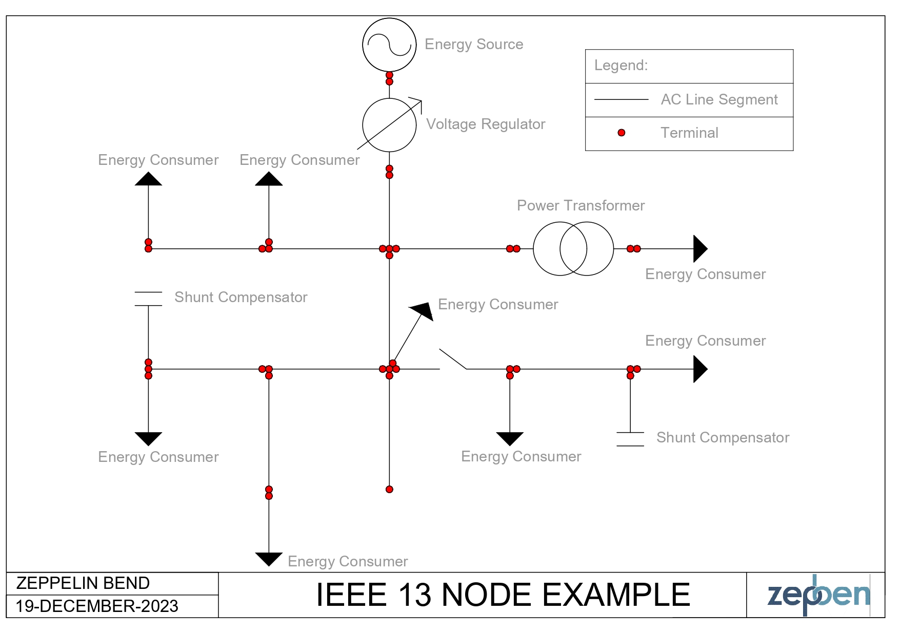

import Tabs from '@theme/Tabs';
import TabItem from '@theme/TabItem';

Sometimes you do not want to pull a model from the EWB server, and instead want to build it locally.
This tutorial demonstrates how to build a model locally. In this example, we will build the IEEE 13 node test feeder (shown below) using the `zepben.evolve` framework.
The detailed information about the IEEE 13 node test feeder can be found [here](https://cmte.ieee.org/pes-testfeeders/resources/).



## Getting Started

Ensure that you have installed and imported the required dependencies.

```python
from typing import Tuple

import numpy
from zepben.evolve import AcLineSegment, Disconnector, PowerTransformer, TransformerFunctionKind, NetworkService, Terminal, PowerTransformerEnd, EnergyConsumer, \
    PerLengthSequenceImpedance, PhaseCode, EnergyConsumerPhase, SinglePhaseKind, LinearShuntCompensator, ShuntCompensatorInfo, Feeder, \
    LvFeeder, BaseVoltage, Breaker

__all__ = ["network"]
```

Also ensure that you have correctly defined the constants `METRES_PER_FOOT` and `FEET_PER_MILE`.
In this example, the constant named METRES_PER_FOOT is defined with a value of 0.3048. This constant represents the conversion factor from feet to meters, and will be used later in the code when setting the lengths of various power lines in the network model.
The constant named FEET_PER_MILE is defined with a value of 5280. This constant represents the number of feet in a mile. It is used in the calculation of per-meter impedance values for the power lines in the network model.

```python
FEET_PER_MILE = 5280
METRES_PER_FOOT = 0.3048
```

## Define Base Voltages

We define base voltages for medium voltage (mv) and low voltage (lv).
These are crucial for specifying the nominal voltage of various components in the network.
The medium and low voltages of the IEEE 13 node network are defined at 4.16kV and 0.48kV, respectively.

```python
mv = BaseVoltage(mrid="mv", nominal_voltage=4_160)
lv = BaseVoltage(mrid="lv", nominal_voltage=480)
```

## Create Equipment and Terminals

In this step, we will create instances of various electrical equipment such as Power Transformers, Power Transformer Ends, AC Line Segments, Disconnectors, Energy Consumers, Energy Consumer Phases, Liner Shunt Compensators, and Terminals.
Each piece of equipment is assigned a unique identifier (mRID), and terminals are created for each equipment to associate connectivity (later in this tutorial).
For more details about creating specific power system equipment and terminals, refer to the [Examine Connectivity of a Power Network](examine-connectivity.mdx) tutorial.

- Create the Voltage Regulator

Note that we will use the PowerTransformer class to create a Power Transformer and then select the function as `TransformerFunctionKind.voltageRegulator` to create a Voltage Regulator.
For each Power Transformer you create, you will need to also create the Power Transformer Ends to associate the primary and secondary winding details about the transformer. For example, for a two-winding transformer, you will need to create two ends (a primary and a secondary end).

```python
vr_650_632_t1, vr_650_632_t2 = Terminal(mrid="vr_650_632_t1"), Terminal(mrid="vr_650_632_t2")
vr_650_632_e1 = PowerTransformerEnd(mrid="vr_650_632_e1", terminal=vr_650_632_t1, rated_u=mv.nominal_voltage)
vr_650_632_e2 = PowerTransformerEnd(mrid="vr_650_632_e2", terminal=vr_650_632_t2, rated_u=mv.nominal_voltage)
vr_650_632 = PowerTransformer(mrid="vr_650_632", function=TransformerFunctionKind.voltageRegulator, terminals=[vr_650_632_t1, vr_650_632_t2],
                              power_transformer_ends=[vr_650_632_e1, vr_650_632_e2])
```

- Create AC Line Segments

```python
# Line 632 to 645
l_632_645_t1, l_632_645_t2 = Terminal(mrid="l_632_645_t1", phases=PhaseCode.BCN), Terminal(mrid="l_632_645_t2", phases=PhaseCode.BCN)
l_632_645 = AcLineSegment(mrid="l_632_645", length=500 * METRES_PER_FOOT, terminals=[l_632_645_t1, l_632_645_t2], base_voltage=mv)

# Line 632 to 633
l_632_633_t1, l_632_633_t2 = Terminal(mrid="l_632_633_t1", phases=PhaseCode.ABCN), Terminal(mrid="l_632_633_t2", phases=PhaseCode.ABCN)
l_632_633 = AcLineSegment(mrid="l_632_633", length=500 * METRES_PER_FOOT, terminals=[l_632_633_t1, l_632_633_t2], base_voltage=mv)

# Line 645 to 646
l_645_646_t1, l_645_646_t2 = Terminal(mrid="l_645_646_t1", phases=PhaseCode.BCN), Terminal(mrid="l_645_646_t2", phases=PhaseCode.BCN)
l_645_646 = AcLineSegment(mrid="l_645_646", length=300 * METRES_PER_FOOT, terminals=[l_645_646_t1, l_645_646_t2], base_voltage=mv)

# Line 650 to 632
l_650_632_t1, l_650_632_t2 = Terminal(mrid="l_650_632_t1", phases=PhaseCode.ABCN), Terminal(mrid="l_650_632_t2", phases=PhaseCode.ABCN)
l_650_632 = AcLineSegment(mrid="l_650_632", length=2000 * METRES_PER_FOOT, terminals=[l_650_632_t1, l_650_632_t2], base_voltage=mv)

# Line 684 to 652
l_684_652_t1, l_684_652_t2 = Terminal(mrid="l_684_652_t1", phases=PhaseCode.AN), Terminal(mrid="l_684_652_t2", phases=PhaseCode.AN)
l_684_652 = AcLineSegment(mrid="l_684_652", length=800 * METRES_PER_FOOT, terminals=[l_684_652_t1, l_684_652_t2], base_voltage=mv)

# Line 632 to 671
l_632_671_t1, l_632_671_t2 = Terminal(mrid="l_632_671_t1", phases=PhaseCode.ABCN), Terminal(mrid="l_632_671_t2", phases=PhaseCode.ABCN)
l_632_671 = AcLineSegment(mrid="l_632_671", length=2000 * METRES_PER_FOOT, terminals=[l_632_671_t1, l_632_671_t2], base_voltage=mv)

# Line 671 to 684
l_671_684_t1, l_671_684_t2 = Terminal(mrid="l_671_684_t1", phases=PhaseCode.ACN), Terminal(mrid="l_671_684_t2", phases=PhaseCode.ACN)
l_671_684 = AcLineSegment(mrid="l_671_684", length=300 * METRES_PER_FOOT, terminals=[l_671_684_t1, l_671_684_t2], base_voltage=mv)

# Line 671 to 680
l_671_680_t1, l_671_680_t2 = Terminal(mrid="l_671_680_t1", phases=PhaseCode.ABCN), Terminal(mrid="l_671_680_t2", phases=PhaseCode.ABCN)
l_671_680 = AcLineSegment(mrid="l_671_680", length=1000 * METRES_PER_FOOT, terminals=[l_671_680_t1, l_671_680_t2], base_voltage=mv)

# Line 684 to 611
l_684_611_t1, l_684_611_t2 = Terminal(mrid="l_684_611_t1", phases=PhaseCode.CN), Terminal(mrid="l_684_611_t2", phases=PhaseCode.CN)
l_684_611 = AcLineSegment(mrid="l_684_611", length=300 * METRES_PER_FOOT, terminals=[l_684_611_t1, l_684_611_t2], base_voltage=mv)

# Line 692 to 675
l_692_675_t1, l_692_675_t2 = Terminal(mrid="l_692_675_t1", phases=PhaseCode.ABCN), Terminal(mrid="l_692_675_t2", phases=PhaseCode.ABCN)
l_692_675 = AcLineSegment(mrid="l_692_675", length=500 * METRES_PER_FOOT, terminals=[l_692_675_t1, l_692_675_t2], base_voltage=mv)
```

- Create Power Transformers and Power Transformer Ends

```python
tx_633_634_t1, tx_633_634_t2 = Terminal(mrid="tx_633_634_t1", phases=PhaseCode.ABCN), Terminal(mrid="tx_633_634_t2", phases=PhaseCode.ABCN)
tx_633_634_e1 = PowerTransformerEnd(mrid="tx_633_634_e1", terminal=tx_633_634_t1, rated_u=mv.nominal_voltage)
tx_633_634_e2 = PowerTransformerEnd(mrid="tx_633_634_e2", terminal=tx_633_634_t2, rated_u=lv.nominal_voltage)
tx_633_634 = PowerTransformer(mrid="tx_633_634", terminals=[tx_633_634_t1, tx_633_634_t2], power_transformer_ends=[tx_633_634_e1, tx_633_634_e2])
```

- Create the Disconnector (Switch)

```python
sw_671_692_t1, sw_671_692_t2 = Terminal(mrid="sw_671_692_t1", phases=PhaseCode.ABCN), Terminal(mrid="sw_671_692_t2", phases=PhaseCode.ABCN)
sw_671_692 = Disconnector(mrid="sw_671_692", terminals=[sw_671_692_t1, sw_671_692_t2], base_voltage=mv)
```

- Create Shunt Compensators

```python
lsc_675_t= Terminal(mrid="lsc_675_t1", phases=PhaseCode.ABCN)
lsc_675_info = ShuntCompensatorInfo(mrid="lsc_675_info", rated_voltage=4160, rated_current=48.077, rated_reactive_power=200000)
lsc_675 = LinearShuntCompensator(mrid="lsc_675", terminals=[lsc_675_t], asset_info=lsc_675_info)

lsc_611_t = Terminal(mrid="lsc_611_t1", phases=PhaseCode.CN)
lsc_611_info = ShuntCompensatorInfo(mrid="lsc_611_info", rated_voltage=4160, rated_current=24.048, rated_reactive_power=100000)
lsc_611 = LinearShuntCompensator(mrid="lsc_611", terminals=[lsc_611_t], asset_info=lsc_611_info)
```

- Create Energy Consumers and Energy Consumer Phases

Note that you will need specify the phases for the EnergyConsumer. EnergyConsumerPhase is a single phase of an energy consumer, which takes the following arguments.

>- phase: SinglePhaseKind = SinglePhaseKind.X - Phase of this energy consumer component.
>- p: Optional[float] = None - Active power of the load.
>- q: Optional[float] = None - Reactive power of the load.
>- p_fixed: Optional[float] = None - Active power of the load that is a fixed quantity.
>- q_fixed: Optional[float] = None - Reactive power of the load that is a fixed quantity.


```python
ec_634_t = Terminal(mrid="ec_634_t", phases=PhaseCode.ABCN)
ec_634_pha = EnergyConsumerPhase(mrid="ec_634_pha", phase=SinglePhaseKind.A, p_fixed=160000, q_fixed=110000)
ec_634_phb = EnergyConsumerPhase(mrid="ec_634_phb", phase=SinglePhaseKind.B, p_fixed=120000, q_fixed=90000)
ec_634_phc = EnergyConsumerPhase(mrid="ec_634_phc", phase=SinglePhaseKind.C, p_fixed=120000, q_fixed=90000)
ec_634 = EnergyConsumer(mrid="ec_634", terminals=[ec_634_t], energy_consumer_phases=[ec_634_pha, ec_634_phb, ec_634_phc], base_voltage=lv)

ec_645_t = Terminal(mrid="ec_645_t", phases=PhaseCode.ABCN)
ec_645_pha = EnergyConsumerPhase(mrid="ec_645_pha", phase=SinglePhaseKind.A, p_fixed=0, q_fixed=0)
ec_645_phb = EnergyConsumerPhase(mrid="ec_645_phb", phase=SinglePhaseKind.B, p_fixed=170000, q_fixed=125000)
ec_645_phc = EnergyConsumerPhase(mrid="ec_645_phc", phase=SinglePhaseKind.C, p_fixed=0, q_fixed=0)
ec_645 = EnergyConsumer(mrid="ec_645", terminals=[ec_645_t], energy_consumer_phases=[ec_645_pha, ec_645_phb, ec_645_phc], base_voltage=mv)

ec_646_t = Terminal(mrid="ec_646_t", phases=PhaseCode.ABC)
ec_646_pha = EnergyConsumerPhase(mrid="ec_646_pha", phase=SinglePhaseKind.A, p=0, q=0)
ec_646_phb = EnergyConsumerPhase(mrid="ec_646_phb", phase=SinglePhaseKind.B, p=230000, q=132000)
ec_646_phc = EnergyConsumerPhase(mrid="ec_646_phc", phase=SinglePhaseKind.C, p=0, q=0)
ec_646 = EnergyConsumer(mrid="ec_646", terminals=[ec_646_t], energy_consumer_phases=[ec_646_pha, ec_646_phb, ec_646_phc], base_voltage=mv)

ec_652_t = Terminal(mrid="ec_652_t", phases=PhaseCode.ABCN)
ec_652_pha = EnergyConsumerPhase(mrid="ec_652_pha", phase=SinglePhaseKind.A, p=128000, q=86000)
ec_652_phb = EnergyConsumerPhase(mrid="ec_652_phb", phase=SinglePhaseKind.B, p=0, q=0)
ec_652_phc = EnergyConsumerPhase(mrid="ec_652_phc", phase=SinglePhaseKind.C, p=0, q=0)
ec_652 = EnergyConsumer(mrid="ec_652", terminals=[ec_652_t], energy_consumer_phases=[ec_652_pha, ec_652_phb, ec_652_phc], base_voltage=mv)

ec_671_t = Terminal(mrid="ec_671_t", phases=PhaseCode.ABC)
ec_671_pha = EnergyConsumerPhase(mrid="ec_671_pha", phase=SinglePhaseKind.A, p_fixed=385000, q_fixed=220000)
ec_671_phb = EnergyConsumerPhase(mrid="ec_671_phb", phase=SinglePhaseKind.B, p_fixed=385000, q_fixed=220000)
ec_671_phc = EnergyConsumerPhase(mrid="ec_671_phc", phase=SinglePhaseKind.C, p_fixed=385000, q_fixed=220000)
ec_671 = EnergyConsumer(mrid="ec_671", terminals=[ec_671_t], energy_consumer_phases=[ec_671_pha, ec_671_phb, ec_671_phc], base_voltage=mv)

ec_675_t = Terminal(mrid="ec_675_t", phases=PhaseCode.ABCN)
ec_675_pha = EnergyConsumerPhase(mrid="ec_675_pha", phase=SinglePhaseKind.A, p_fixed=485000, q_fixed=190000)
ec_675_phb = EnergyConsumerPhase(mrid="ec_675_phb", phase=SinglePhaseKind.B, p_fixed=68000, q_fixed=60000)
ec_675_phc = EnergyConsumerPhase(mrid="ec_675_phc", phase=SinglePhaseKind.C, p_fixed=290000, q_fixed=212000)
ec_675 = EnergyConsumer(mrid="ec_675", terminals=[ec_675_t], energy_consumer_phases=[ec_675_pha, ec_675_phb, ec_675_phc], base_voltage=mv)

ec_692_t = Terminal(mrid="ec_692_t", phases=PhaseCode.ABC)
ec_692_pha = EnergyConsumerPhase(mrid="ec_692_pha", phase=SinglePhaseKind.A, p=0, q=0)
ec_692_phb = EnergyConsumerPhase(mrid="ec_692_phb", phase=SinglePhaseKind.B, p=0, q=0)
ec_692_phc = EnergyConsumerPhase(mrid="ec_692_phc", phase=SinglePhaseKind.C, p=170000, q=151000)
ec_692 = EnergyConsumer(mrid="ec_692", terminals=[ec_692_t], energy_consumer_phases=[ec_692_pha, ec_692_phb, ec_692_phc], base_voltage=mv)

ec_611_t = Terminal(mrid="ec_611_t", phases=PhaseCode.ABCN)
ec_611_pha = EnergyConsumerPhase(mrid="ec_611_pha", phase=SinglePhaseKind.A, p=0, q=0)
ec_611_phb = EnergyConsumerPhase(mrid="ec_611_phb", phase=SinglePhaseKind.B, p=0, q=0)
ec_611_phc = EnergyConsumerPhase(mrid="ec_611_phc", phase=SinglePhaseKind.C, p=170000, q=80000)
ec_611 = EnergyConsumer(mrid="ec_611", terminals=[ec_611_t], energy_consumer_phases=[ec_611_pha, ec_611_phb, ec_611_phc], base_voltage=mv)
```

## Set Line Impedance

Now, you need to assign per length sequence impedance to the lines in the network.
These impedance's represent the electrical characteristics of the lines.
The impedance data for lines are represented as line impedance matrices by IEEE.
Hence, the following function is used to convert the line impedance matrices to sequence impedance and admittance parameters per unit length (supported format by the `PerLengthSequenceImpedance` class).

```python
def plsi_from_z_per_mile(mrid: str, *impedances: Tuple[float, float]):
    r_per_metre, x_per_metre = numpy.mean(impedances, axis=0) / (METRES_PER_FOOT * FEET_PER_MILE)
    return PerLengthSequenceImpedance(mrid=mrid, r=r_per_metre, x=x_per_metre)
```

Using the above function, convert the IEEE line impedance matrix configurations to sequence impedance and admittance parameters per unit length, as follows.

```python
plsi_601 = plsi_from_z_per_mile("plsi_601", (0.3465, 1.0179), (0.3375, 1.0478), (0.3414, 1.0348))
plsi_602 = plsi_from_z_per_mile("plsi_602", (0.7526, 1.1814), (0.7475, 1.1983), (0.7436, 1.2112))
plsi_603 = plsi_from_z_per_mile("plsi_603", (1.3294, 1.3471), (1.3238, 1.3569))
plsi_604 = plsi_from_z_per_mile("plsi_604", (1.3238, 1.3569), (1.3294, 1.3471))
plsi_605 = plsi_from_z_per_mile("plsi_605", (1.3292, 1.3475))
plsi_606 = plsi_from_z_per_mile("plsi_606", (0.7982, 0.4463), (0.7891, 0.4041), (0.7982, 0.4463))
plsi_607 = plsi_from_z_per_mile("plsi_607", (1.3425, 0.5124))
```

Assign the per length sequence impedance to the lines, as follows.

```python
l_632_645.per_length_sequence_impedance = plsi_603
l_632_633.per_length_sequence_impedance = plsi_602
l_645_646.per_length_sequence_impedance = plsi_603
l_650_632.per_length_sequence_impedance = plsi_601
l_684_652.per_length_sequence_impedance = plsi_607
l_632_671.per_length_sequence_impedance = plsi_601
l_671_684.per_length_sequence_impedance = plsi_604
l_671_680.per_length_sequence_impedance = plsi_601
l_684_611.per_length_sequence_impedance = plsi_605
l_692_675.per_length_sequence_impedance = plsi_606
```

## Define Containers

The next step is to define the containers to represent the high-voltage and low-voltage feeders in the network.
These containers help organize and manage different sections of the electrical system.

```python
hv_fdr = Feeder(mrid="hv_fdr", normal_head_terminal=br_650_t2)
lv_fdr = LvFeeder(mrid="lv_fdr", normal_head_terminal=tx_633_634_t2)
```

## Build Network Model

In this step, we create a `NetworkService` instance and add all the created equipment and terminals to it.
This step essentially assembles the entire network.

```python
network = NetworkService()
for io in [vr_650_632, vr_650_632_t1, vr_650_632_t2, vr_650_632_e1, vr_650_632_e2, l_632_645, l_632_645_t1, l_632_645_t2,
           l_632_633, l_632_633_t1, l_632_633_t2, tx_633_634, tx_633_634_t1, tx_633_634_t2, tx_633_634_e1, tx_633_634_e2, l_645_646, l_645_646_t1, l_645_646_t2,
           l_650_632, l_650_632_t1, l_650_632_t2, l_684_652, l_684_652_t1, l_684_652_t2, l_632_671, l_632_671_t1, l_632_671_t2, l_671_684, l_671_684_t1,
           l_671_684_t2, l_671_680, l_671_680_t1, l_671_680_t2, sw_671_692, sw_671_692_t1, sw_671_692_t2, l_684_611, l_684_611_t1, l_684_611_t2, l_692_675,
           l_692_675_t1, l_692_675_t2, ec_634_t, ec_634_pha, ec_634_phb, ec_634_phc, ec_634, ec_645_t, ec_645_pha, ec_645_phb, ec_645_phc, ec_645, ec_646_t,
           ec_646_pha, ec_646_phb, ec_646_phc, ec_646, ec_652_t, ec_652_pha, ec_652_phb, ec_652_phc, ec_652, ec_671_t, ec_671_pha, ec_671_phb, ec_671_phc,
           ec_671, ec_675_t, ec_675_pha, ec_675_phb, ec_675_phc, ec_675, ec_692_t, ec_692_pha, ec_692_phb, ec_692_phc, ec_692, ec_611_t, ec_611_pha, ec_611_phb,
           ec_611_phc, ec_611, lsc_675_t, lsc_675_info, lsc_675, lsc_611_t, lsc_611_info, lsc_611, plsi_601, plsi_602, plsi_603, plsi_604, plsi_605, plsi_606,
           plsi_607, hv_fdr, lv_fdr, mv, lv]:
    network.add(io)
```

## Connect Terminals

The final step is to connect the terminals of different equipment to form the complete electrical network. This involves establishing the physical connections between various components (as shown in the single line diagram above).

```python
# Complete 650-632 regulator + line
network.connect_terminals(vr_650_632_t2, l_650_632_t1)

# Node 611
network.connect_terminals(l_684_611_t2, lsc_611_t)
network.connect_terminals(l_684_611_t2, ec_611_t)

# Node 632
network.connect_terminals(l_650_632_t2, l_632_633_t1)
network.connect_terminals(l_650_632_t2, l_632_645_t1)
network.connect_terminals(l_650_632_t2, l_632_671_t1)

# Node 633
network.connect_terminals(l_632_633_t2, tx_633_634_t1)

# Node 634
network.connect_terminals(tx_633_634_t2, ec_634_t)

# Node 645
network.connect_terminals(l_632_645_t2, l_645_646_t1)
network.connect_terminals(l_632_645_t2, ec_645_t)

# Node 646
network.connect_terminals(l_645_646_t2, ec_646_t)

# Node 650
network.connect_terminals(br_650_t2, vr_650_632_t1)

# Node 652
network.connect_terminals(l_684_652_t2, ec_652_t)

# Node 671
network.connect_terminals(l_632_671_t2, l_671_680_t1)
network.connect_terminals(l_632_671_t2, l_671_684_t1)
network.connect_terminals(l_632_671_t2, sw_671_692_t1)
network.connect_terminals(l_632_671_t2, ec_671_t)

# Node 675
network.connect_terminals(l_692_675_t2, lsc_675_t)
network.connect_terminals(l_692_675_t2, ec_675_t)

# Node 684
network.connect_terminals(l_671_684_t2, l_684_611_t1)
network.connect_terminals(l_671_684_t2, l_684_652_t1)

# Node 692
network.connect_terminals(sw_671_692_t2, l_692_675_t1)
network.connect_terminals(sw_671_692_t2, ec_692_t)
```