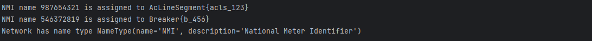
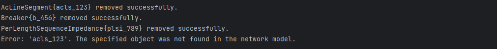

import Tabs from '@theme/Tabs';
import TabItem from '@theme/TabItem';

A `NetworkService` is a mutable node breaker network model that implements a subset of IEC61968 and IEC61970 CIM classes.
It is essentially a collection of `IdentifiedObject`s, and they may be added and removed as desired.
This tutorial demonstrates how to interact with a network service to add or remove objects, query objects and types, add reference resolvers and names, and connect terminals.

## Getting Started

For this example, you will need to import `NetworkService`, `AcLineSegment`, `PerLengthSequenceImpedance`, `Switch`, `Breaker`, `ConductingEquipment`, `NameType`, `Meter`, `EnergySource`, and `Terminal` from `zepben.evolve`.

```python
from zepben.evolve import NetworkService, AcLineSegment, PerLengthSequenceImpedance, Switch, Breaker,
    ConductingEquipment, NameType, Meter, EnergySource, Terminal
```

You will also need to import the `per_length_sequence_impedance` function from `zepben.evolve.services.common.resolver` to be able to run the Resolver part of this tutorial.

```python
from zepben.evolve.services.common.resolver import per_length_sequence_impedance
```

Once you have imported the required dependencies, create a network service to get started with the examples, as follows:

```python
network = NetworkService()
```

## Example 1: Adding Objects

You can add objects such as Ac Line Segments, Power Transformers, Breakers, Energy Consumers, and many more to a network. A few examples are shown below.

We start by adding a line segment and a breaker to the network model, as follows.

```python
line = AcLineSegment(mrid="acls_123")
breaker = Breaker(mrid="b_456")
```
Once you have added the objects, you can print the results to confirm if they were successfully added to the network.

```python
print(f"{line} added? {network.add(line)}")
print(f"{breaker} added? {network.add(breaker)}")
```

Output:


Note that you cannot create an object with a duplicate mRID. For instance, in the same network as above example, let us create an EnergyConsumer with a duplicate mRID `acls_123`, which has already been assigned to the ACLineSegment created above.

```python
invalid = EnergySource(mrid="acls_123")
print(f"{invalid} added? {network.add(invalid)}")
```

Output:


## Example 2: Querying Objects

You can use the `get` method to query the network model for an object with the specified mRID.
For example, let us query the `AcLineSegment` and `Breaker` that we created with mRIDs `acls_123` and `b_456`, respectively.

```python
print(f"Identified object with mrid acls_123: {network.get('acls_123')}")
print(f"Identified object with mrid b_456: {network.get('b_456')}")
```

Output:


Note that the specified mRID should be genuine and must be in the network model. A `KeyError` is raised if no object with the specified mRID is in the network model.

```python
try:
    network.get("not_in_network")
except KeyError as error:
    print(error)
```

Output:


You can also narrow the desired type with the second parameter. In makes the intent clearer, and lets IDEs lint and autocomplete according to the requested type.
For example, let us check if the Breaker (from the above examples) is open or closed.

```python
print(f"Switch with mrid b_456 is open? {network.get('b_456', Switch).is_open()}")
```

Output:


Note that a `TypeError` is raised if the object exists in the network model, but is not the correct type.

```python
try:
    network.get("acls_123", Switch)
except TypeError as error:
    print(error)
```

Output:


## Example 3: Query Types

You can use the `objects` method to iterate over all objects that inherit a specified type.
In this example, we will query the objects from the network based on their types. From the above example, the network consists of a Breaker and an AcLineSegment.
Let us query the object based on the type Switch. Since a Breaker is the only object in the network model that inherits from the `Switch` class, the following must print "Switch: Breaker{b_456}".

```python
for switch in network.objects(Switch):
    print(f"Switch: {switch}")
```

However, since both the Breaker and the AcLineSegment inherit from `ConductingEquipment`, the following must print "Conducting equipment: AcLineSegment{acls_123}" and "Conducting equipment: Breaker{b_456}".

```python
for conducting_equipment in network.objects(ConductingEquipment):
    print(f"Conducting equipment: {conducting_equipment}")
```
Remark: Objects generated by network.objects(BaseType) are ordered by the name of their leaf class, so all `AcLineSegment`s will appear before all `Breaker`s.

Output:


You can also count the number of objects that inherits from a specified type using the `len_of` method. For exmaple, we can count the number if switches and conducting equipment in the network, as follows.

```python
print(f"Number of switches: {network.len_of(Switch)}")
print(f"Number of conducting equipment: {network.len_of(ConductingEquipment)}")
```

Output:


## Example 4: Resolvers

In power system modeling, it is common to represent networks using a collection of identified objects, such as lines, transformers, and impedance elements.
At times, you may encounter scenarios where you need to reconstruct a network model from an unordered collection of these objects.
The `NetworkService` provides a convenient way to handle such cases by allowing you to add reference resolvers.

For this tutorial, we will use the power system network created above. The network contains a breaker and a line. Now, we will focus on a specific type of element called `PerLengthSequenceImpedance`.
`PerLengthSequenceImpedance` is typically used with AcLineSegment and contains the sequence impedance and admittance parameters per unit length.

First, we will add a reference resolver to the network. The `resolve_or_defer_reference` method can be used to add a reference resolver. It takes two arguments, unresolved object (in this case, a per_length_sequence_impedance element), and a unique identifier for that object (e.g., "plsi_789").
The following will add a reference resolver for the per_length_sequence_impedance associated with the AcLineSegment (line) created in above examples.

```python
network.resolve_or_defer_reference(per_length_sequence_impedance(line), "plsi_789")
```

Now that you have added the unresolved reference, let us check whether there are any unresolved references in the network, as follows:

```python
print(f"Network has unresolved references? {network.has_unresolved_references()}")
print(f"plsi_789 has unresolved references? {network.has_unresolved_references('plsi_789')}")
```

Output:


You can also count the number of unresolved references (if required). The `num_unresolved_references` method can be used as follows to count the number of unresolved references.

```python
print(f"Number of unresolved references to plsi_789: {network.num_unresolved_references('plsi_789')}")
print(f"Total unresolved references: {network.num_unresolved_references()}")
```

Output:


Once you have the necessary information, you can add the corresponding objects to the network. In this case, we're adding a `PerLengthSequenceImpedance` with an identifier "plsi_789":

```python
network.add(PerLengthSequenceImpedance(mrid="plsi_789"))
```

You can verify that the reference resolution was successful by checking the unresolved references again. If the reference resolution was successful, you should get zero unresolved references.

## Example 5: Connecting Terminals

In power system modeling, it is essential to establish connectivity between different terminals in a network.
Terminals in a `NetworkService` can be connected using the `connect_terminals` method.

This tutorial will guide you through the process of connecting terminals and creating connectivity nodes.
First, let us create instances of the Terminal class with unique identifiers (mRIDs) and add them to the network.

```python
t1, t2, t3 = Terminal(mrid="t1"), Terminal(mrid="t2"), Terminal(mrid="t3")
network.add(t1)
network.add(t2)
network.add(t3)
```

Use the `connect_terminals` method to automatically create a connectivity node between the specified terminals, unless one of the terminals is already assigned to a connectivity node.

```python
network.connect_terminals(t1, t2)
```

After connecting terminals, you can access the connectivity node and its associated terminals. The following will print the connectivity node's identifier and the terminals associated with it.

```python
cn = t1.connectivity_node
print(f"Connected to node {cn}:")
for terminal in cn.terminals:
    print(f"\t{terminal}")
```

Output:


You can also connect a terminal to a connectivity node using its mRID. This is achieved with the `connect_by_mrid` method.

```python
network.connect_by_mrid(t3, cn.mrid)
```

After connecting the third terminal to the connectivity node, verify the connectivity node and its terminals. The following will print the updated list of terminals associated with the connectivity node.

```python
print(f"Connected to node {cn}:")
for terminal in cn.terminals:
    print(f"\t{terminal}")
```

Output:


## Example 6: Managing Names in a Network Model

In this tutorial, we will explore how to use the NetworkService to manage names in a network model.
Names are associated with identified objects, and each name has a specific type.
We'll focus on the example of adding National Meter Identifier (NMI) names to meters in the network model.

To get started with this example, create two instances of the Meter class as follows:

```python
meter1 = Meter()
meter2 = Meter()
```

Now, create a `NameType` for "NMI" (National Meter Identifier) with a description.
Then, associate the NMI names with the meters using the `get_or_add_name` method.

```python
name_type = NameType(name="NMI", description="National Meter Identifier")
name_type.get_or_add_name("987654321", meter1)
name_type.get_or_add_name("546372819", meter2)
```

Add the NameType to the network model using the `add_name_type` method. Finally, display the assigned names and available name types.

```python
network.add_name_type(name_type)
for name in network.get_name_type("NMI").names:
    print(f"NMI name {name.name} is assigned to {name.identified_object}")
for name_type in network.name_types:
    print(f"Network has name type {name_type}")
```

Output:



## Example 7: Removing Objects

This tutorial covers the usage of the `remove` method in the NetworkService class to remove objects from a network model.
The `remove` method allows you to remove identified objects based on their type and mRID.

To get started with this example, ensure that you have imported the required dependencies and have created a 'network' using the instance of a `NetworkService`.
We will use the name network that we have created for the above examples and will use the `remove` method to remove the instances of Line, Breaker and a PerLengthSequenceImpedance.

- Remove Line

```python
network.remove(line)
print(f"{line} removed successfully.")
```

- Remove Breaker

```python
network.remove(breaker)
print(f"{breaker} removed successfully.")
```

- Remove PerLengthSequenceImpedance

```python
plsi = PerLengthSequenceImpedance(mrid="plsi_789")
network.remove(plsi)
print(f"{plsi} removed successfully.")
```

Note that the `remove` method will raise a KeyError if the object is not found in the network model.
Therefore, it is important to handle the exception to provide a meaningfully feedback to the user.
In the following exercise, we will try to remove the `Line` again (which was already removed).

```python
try:
    network.remove(line)
except KeyError as error:
    print(f"Error: {error}. The specified object was not found in the network model.")
```

Output:


