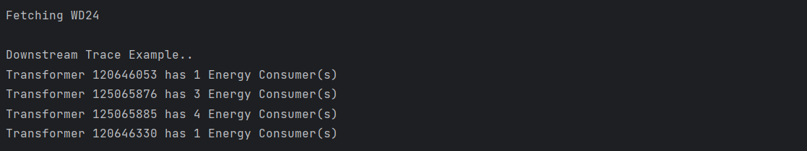
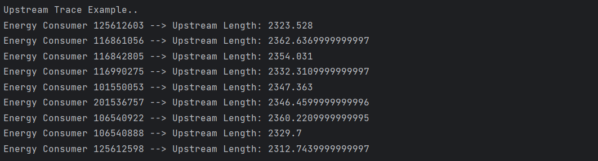

import Tabs from '@theme/Tabs';
import TabItem from '@theme/TabItem';

In this example, we demonstrate the use cases for downstream and upstream tracing within a power network. Specifically, the code performs the following two tasks:

1. **Downstream Trace**: For each transformer, it counts the number of Energy Consumers (ECs) downstream of it. The downstream trace calculates how many Energy Consumers are connected downstream from each transformer, and this count is printed for each transformer.
2. **Upstream Trace**: For each Energy Consumer, the code calculates the upstream length from the Energy Consumer to the feeder head. This upstream trace calculates the total length of the cables (in kilometers or meters) that lead upstream from each Energy Consumer.

## Overview of the Code

The code in this example connects to a Network Consumer Client, uses `normal_downstream_trace` to trace downstream from each `PowerTransformer`, and uses `normal_upstream_trace` to trace upstream from each `EnergyConsumer`. It fetches data for the specified feeder, processes the network objects (PowerTransformers and EnergyConsumers), and performs the respective traces.

The results are printed as follows:

- **Downstream Trace**: For each `PowerTransformer`, it prints the number of `EnergyConsumers` downstream.
- **Upstream Trace**: For each `EnergyConsumer`, it prints the total length of the upstream cables to the feeder head.

## Key Imports

To run/test this example, ensure that you have installed the following libraries as they are used to interact with the Evolve API, perform network tracing, and work with the network equipment models.

```python
import asyncio
import json
from zepben.evolve import NetworkConsumerClient, PhaseStep, PhaseCode, AcLineSegment, normal_downstream_trace, connect_with_token, EnergyConsumer, PowerTransformer, normal_upstream_trace
from zepben.evolve.services.network.tracing.phases.phase_step import start_at
from zepben.protobuf.nc.nc_requests_pb2 import IncludedEnergizedContainers
```

## Configuration

The `config.json` file contains the connection details for the server. It includes the server's host address, access token, and the RPC port. Ensure that you have replaced `your_server_host`, `your_access_token`, and `rpc_port` with the specific details.

```json
{
  "host": "your_server_host",
  "access_token": "your_access_token",
  "rpc_port": 1234
}
```

## Code Breakdown

### Step 1: Connect to the EWB Server

The code first loads the connection configuration from `config.json`, then establishes a connection to the server using `connect_with_token`:

```python
channel = connect_with_token(host=c["host"], access_token=c["access_token"], rpc_port=c["rpc_port"])
```

A `NetworkConsumerClient` object is created, which will be used to interact with the network data.

### Step 2: Fetch Feeder Network

Once connected, the code retrieves the network hierarchy of the feeders using the `get_network_hierarchy` method:

```python
result = (await client.get_network_hierarchy()).throw_on_error().result
```

The network data for each feeder is processed and fetched through the `get_feeder_network` function, which includes energized LV feeders.

### Step 3: Perform Downstream Trace

For each `PowerTransformer`, the downstream trace is performed using `normal_downstream_trace`. The `get_downstream_customer_count` function is called for each `PowerTransformer` to determine the number of `EnergyConsumers` downstream:

```python
for io in network.objects(PowerTransformer):
    customers = await get_downstream_customer_count(start_at(io, PhaseCode.ABCN))
    print(f"Transformer {io.mrid} has {customers} Energy Consumer(s)")
```

Here, `start_at(io, PhaseCode.ABCN)` indicates that the trace starts from the `PowerTransformer` `io`, using the `ABCN` phase configuration.

### Step 4: Perform Upstream Trace

For each `EnergyConsumer`, the upstream trace is performed using `normal_upstream_trace`. The `get_upstream_length` function calculates the total upstream length for each `EnergyConsumer`:

```python
for ec in network.objects(EnergyConsumer):
    upstream_length = await get_upstream_length(start_at(ec, PhaseCode.ABCN))
    print(f"Energy Consumer {ec.mrid} --> Upstream Length: {upstream_length}")
```

The upstream length is calculated by adding up the length of each `AcLineSegment` that leads upstream from the `EnergyConsumer` until the feeder head is reached.

### Step 5: Define Trace Actions

The `get_downstream_customer_count` and `get_upstream_length` functions use trace action definitions to perform the downstream and upstream traces.

For downstream tracing:

```python
async def get_downstream_customer_count(ce: PhaseStep) -> int:
    trace = normal_downstream_trace()
    customer_count = 0

    def collect_eq_in():
        async def add_eq(ps, _):
            nonlocal customer_count
            if isinstance(ps.conducting_equipment, EnergyConsumer):
                customer_count += 1
        return add_eq

    trace.add_step_action(collect_eq_in())
    await trace.run(ce)
    return customer_count
```

For upstream tracing:

```python
async def get_upstream_length(ce: PhaseStep) -> int:
    trace = normal_upstream_trace()
    upstream_length = 0

    def collect_eq_in():
        async def add_eq(ps, _):
            nonlocal upstream_length
            if isinstance(ps.conducting_equipment, AcLineSegment):
                if ps.conducting_equipment.length is not None:
                    upstream_length = upstream_length + ps.conducting_equipment.length
        return add_eq

    trace.add_step_action(collect_eq_in())
    await trace.run(ce)
    return upstream_length
```

### Step 6: Run the Tracing Process

Finally, the main function runs the process using `asyncio`. It processes the specified feeder, performs downstream traces for `PowerTransformers`, and upstream traces for `EnergyConsumers`.

```python
if __name__ == "__main__":
    loop = asyncio.get_event_loop()
    loop.run_until_complete(main())
```

## Output

### Downstream Trace
The following is a sample output for the downstream trace.


### Upstream trace
The following is a sample output for the upstream trace.
